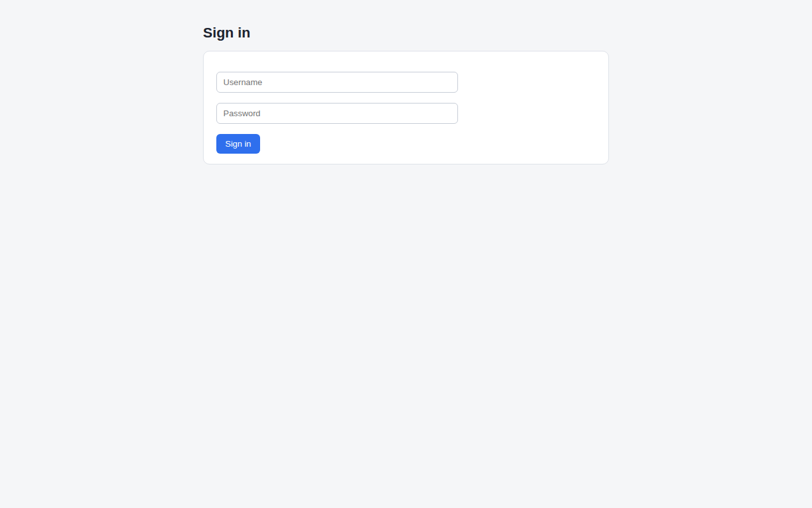
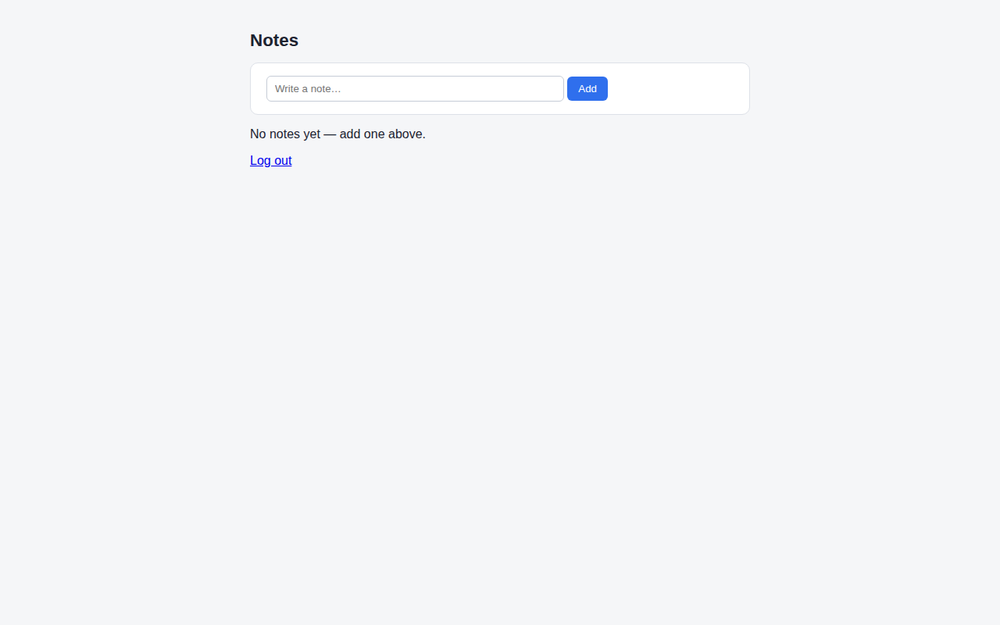
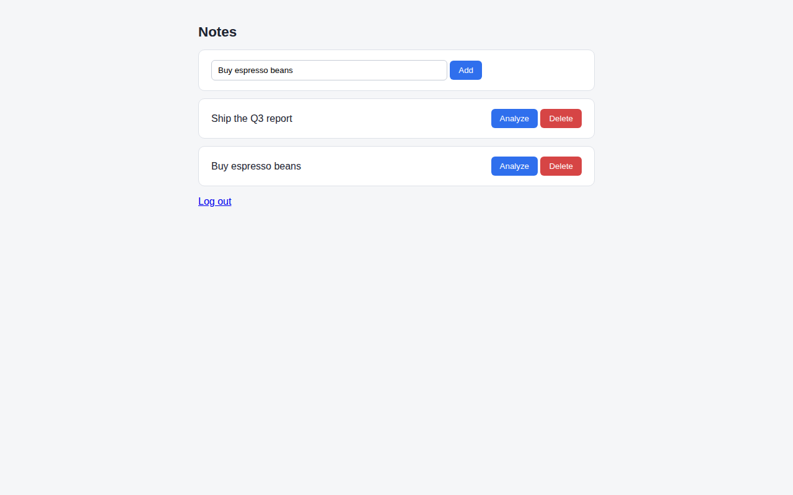
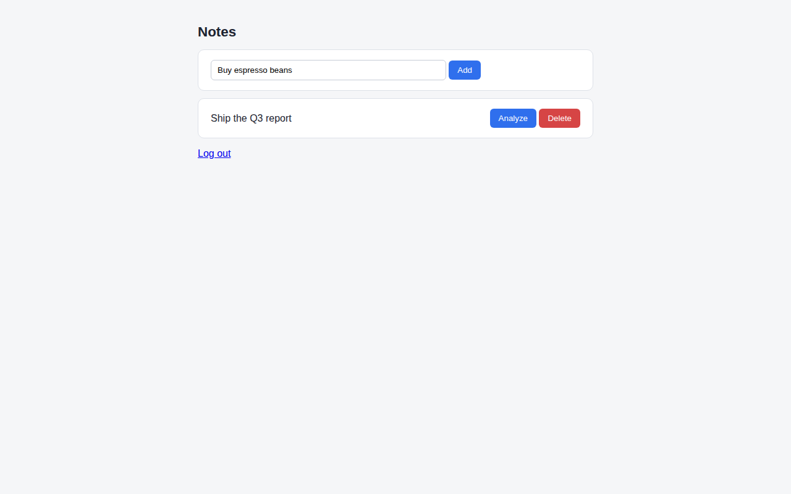
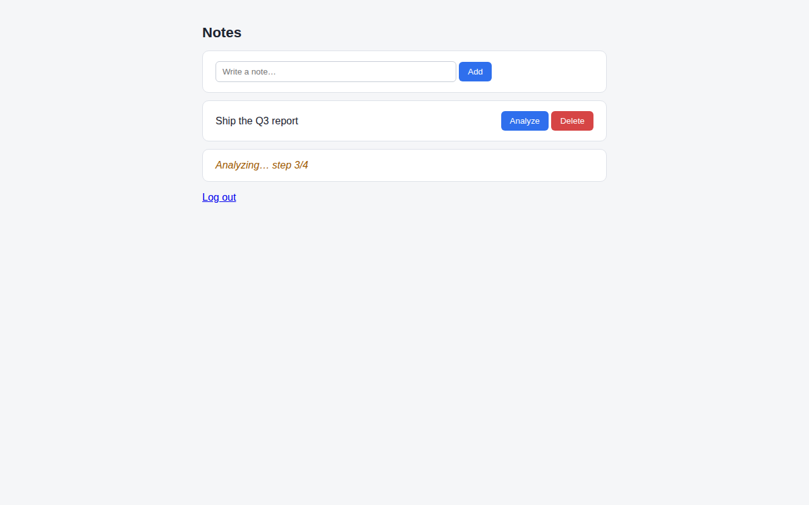
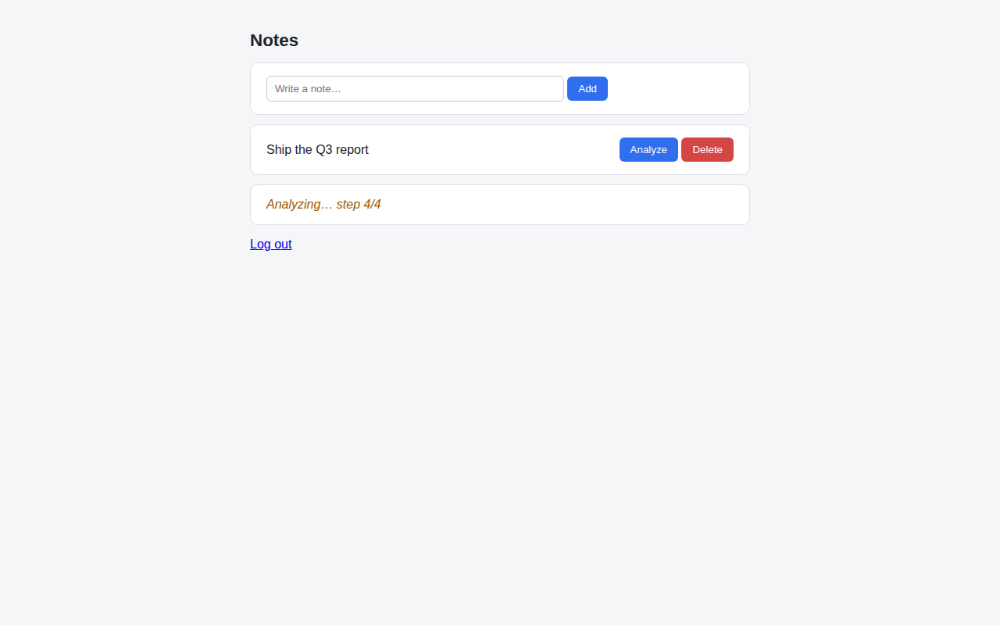
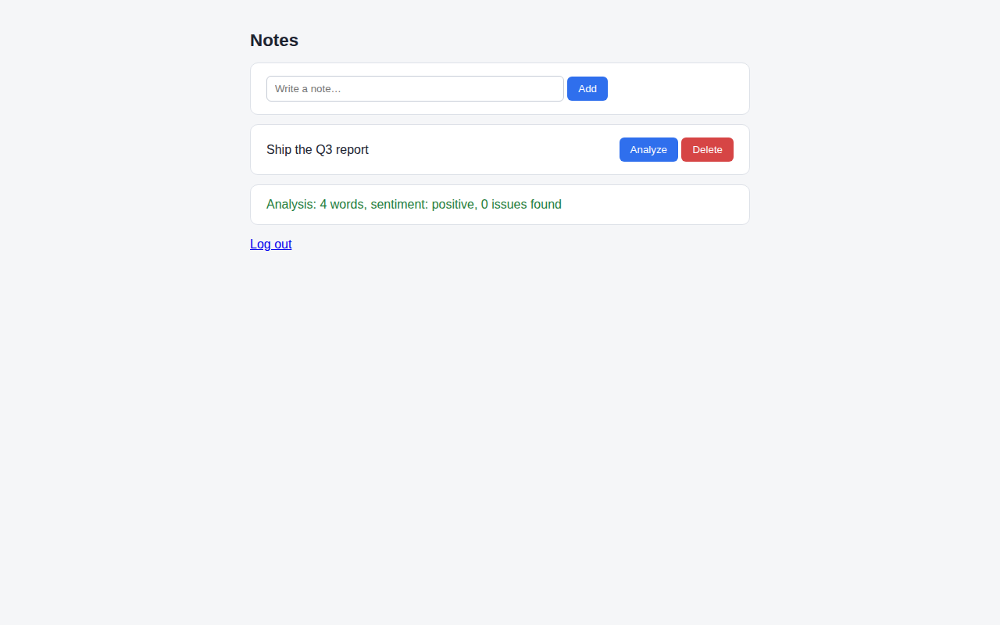
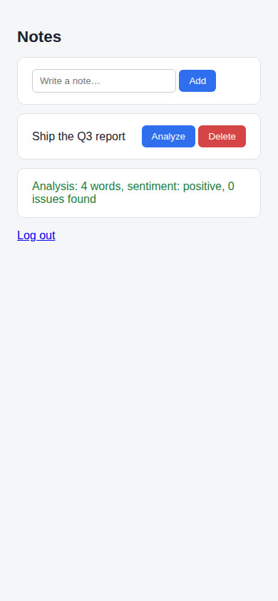

# ccwalk demo Visual Walkthrough

- Generated: 20260829-220605
- Git HEAD: `8d50e1b`
- App: http://localhost:8123 (reachable)
- Spec: demo/tour.py
- **6 steps** — PASS 6 / WARN 0 / FAIL 0

## 1. login_page — PASS
_group: login · 146ms_

The sign-in page as an anonymous visitor sees it

- [x] login title visible (visible)
- [x] submit button visible (visible)

## 2. login_submit — PASS
_group: login · 198ms_

Filling credentials and signing in lands on the notes list

- [x] notes page reached (visible)
- [x] empty state shown before any notes exist (visible)

[video: videos/login.webm](videos/login.webm)

## 3. add_notes — PASS
_group: notes · 528ms_

Adding two notes over htmx updates the list without a page reload

- [x] two notes listed (found 2, expected >= 2)
- [x] first note text correct (text_contains 'Q3 report' in 'Ship the Q3 report')

## 4. delete_note — PASS
_group: notes · 453ms_

Deleting the second note removes it from the list

> **Note:** note-2 absence is implied by the final screenshot; presence-of-absence assertions are deliberately out of scope for v0.1.

- [x] first note still present (visible)

[video: videos/notes.webm](videos/notes.webm)

## 5. analyze_note — PASS
_group: analysis · 5151ms_

The Analyze action runs ~4s server-side; the tour captures the in-progress state and the final result

- [x] analysis result rendered (text_contains 'words' in 'Analysis: 4 words, sentiment: positive, 0 issues found')

[video: videos/analysis.webm](videos/analysis.webm)

## 6. mobile_notes — PASS
_group: mobile · 378ms_

The notes list on a phone-sized viewport

- [x] note form usable on mobile (visible)

[video: videos/mobile.webm](videos/mobile.webm)
